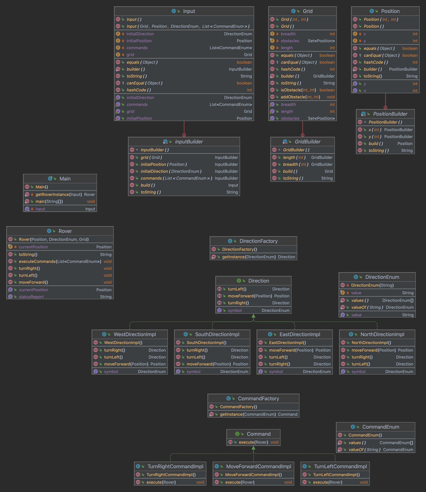

# Mars-Rover

<!-- TOC -->
* [Mars-Rover](#mars-rover)
  * [Problem Statement](#problem-statement)
  * [Class Level Diagram](#class-level-diagram)
<!-- TOC -->

## Problem Statement

Create a Mars Rover simulation with grid-based terrain navigation. The Rover must have actions to move forward, turn left, and turn right, while avoiding obstacles and staying within grid boundaries. Utilize Object-Oriented Programming, design patterns, and minimize the use of if-else conditions.

## Class Level Diagram

- Design patterns have been used and Exception handling has been done to ensure code quality and extensibility for future development.

### Instructions

1. Clone the repository or download the code files to your local machine.

2. Open your terminal or command prompt.

3. Navigate to the directory containing the code files.

4. Run the main.java file

## Running the Program

1. Run the program by executing it in your terminal or command prompt.

2. Enter the grid size (length and breadth) and the number of obstacles.

3. Input the coordinates of each obstacle.

4. Specify the starting position (x, y) and direction (N, S, E, W) of the rover.

5. Enter the movement commands for the rover (e.g., `MMRMLM`).

6. The program will simulate the rover's movement, and the final position and direction will be displayed.

